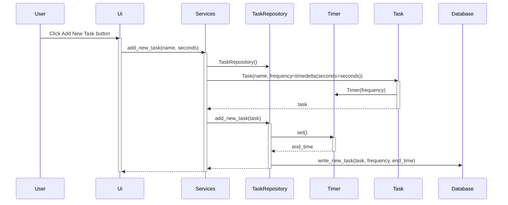
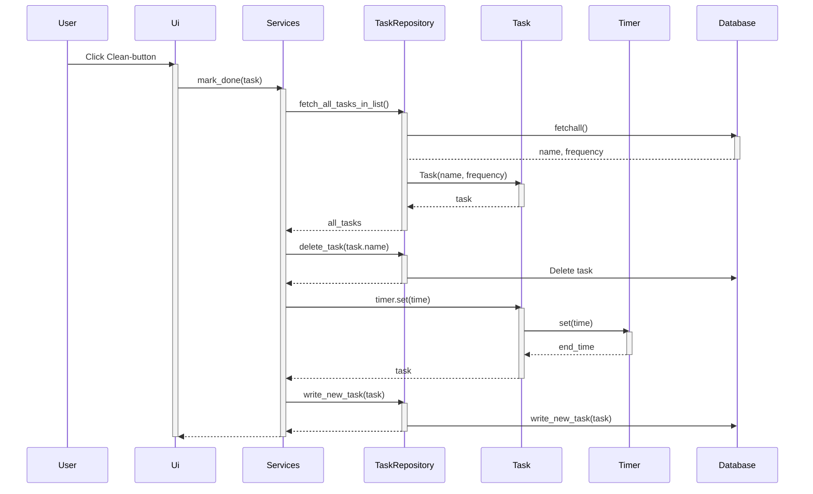

# Arkkitehtuurikuvaus

## Rakenne

Sovellus koostuu neljästä hakemistosta. Ui vastaa sovelluksen graafisesta käyttöliittymästä. Se on erotettu sovelluslogiikasta. Siinä on kolme luokkaa. Services vastaa ohjelman toiminnallisuuksista ja sovelluslogiikasta. Se toimii tavallaan käyttöliittymän ja sovelluksen muiden osien välissä. Entities- hakemistossa on kaksi luokkaa, siivottavia kohteita kuvaava Task sekä ajastin eli Timer. Repositories-hakemisto vastaa tietojen tallentamisesta ja tallennettujen tietojen hakemisesta tietokannasta.

## Sovelluslogiikka

Sovellus käsittelee tehtäviä Task-luokan mukaisina olioina. Task-luokka käyttää Timer-ajastinta puhtauden tai likaisuuden määrittelyyn.

Services-luokassa on suurin osa ohjelman toiminnallisuudesta. Sieltä löytyy esim. seuraavat metodit:
- get_all_tasks() 
- add_new_task()
- mark_done()

Repositories tallentaa tehtäviä tietokantaan ja palauttaa sovelluksen käyttöön listoja tallennetuista tehtävistä.

Alla oleva pakkauskaavio havainnollistaa visuaalisesti luokkien suhteita.

## Käyttöliittymä

Sovelluksen käyttöliittymä on eriytetty sovelluslogiikasta mahdollisimman hyvin. Se on yhteydessä ohjelman toiminnallisuuteen services-luokan metodien kautta. 

Käyttöliittymässä on kaksi eri näkymää:
- Tehtävälistanäkymä ja
- Uuden tehtävän lisäysnäkymä.

Sovellus avautuu tehtävälistanäkymään, josta pääsee uuden tehtävän lisäysnäkymään nappia painamalla. Molemmat näkymät on toteutettu omassa luokassaan. Lisäksi ui-hakemistosta löytyy luokka UI, joka vastaa näkymien näyttämisestä ja vaihtamisesta.

## Tietojen pysyväistallennus

Tietojen tallennus on toteutettu Repository-mallilla. TaskRepository-luokka tallentaa tiedot SQLite-tietokantaan. Tiedot tallentuvat data.sqlite-nimiseen tiedostoon. Tiedoston nimi on määritelty database_connection.py-tiedostossa. Tietokantataulu on määritelty initialize_db.py-tiedostossa. Taulun nimeksi tulee tasks, ja siinä on sarakkeet name (tehtävän nimi), frequency_s (toistuvuus) ja end_time (ajastimen päättymisaika).

## Toiminnallisuus

Ohessa on kuvattu pari ohjeman perustoiminnallisuutta sekvenssikaavioina.

### Uuden tehtävän lisääminen

Käyttäjä lisää uuden tehtävän ja syöttää sen tiedot, eli nimen ja toistuvuuden.

Käyttöliittymä antaa Services-luokalle tehtävän. Services kutsuu Task-luokkaa muodostaakseen tiedoista olion, ja välittää tämän olion TaskRepository-luokalle, joka tallentaa sen tietokantaan.

### Tehtävän merkitseminen tehdyksi

Käyttäjä painaa nappulaa, joka merkitsee tehtävän tehdyksi.

Käyttöliittymä antaa tehtävän Services-luokalle. Services-luokan metodi hakee repositorion kautta tietokannasta listan tehtävistä. Repositorion metodi muuttaa tekstimuodossa olevat tehtävät Task-olioiksi. Services-luokan metodi vertaa tehtävien nimiä sen tehtävän nimeen, jonka kohdalla nappia on painettu. Kun ohjelma löytää listalta oikean nimen, se poistaa tehtävän tietokannasta, hakee tehtävälle uuden päättymisajan ja tallentaa sen uudestaan.
