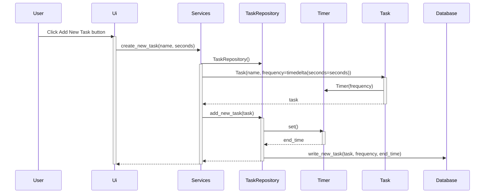

# Arkkitehtuurikuvaus

## Rakenne

Sovellus tulee koostumaan neljästä hakemistosta. Ui tulee vastaamaan käyttöliittymästä. Se on erotettu sovelluslogiikasta. En ole vielä toteuttanut sitä. Services vastaa ohjelman toiminnallisuuksista ja
sovelluslogiikasta. Se toimii tavallaan käyttöliittymän ja sovelluksen muiden osien välissä. Entities- hakemistossa on kaksi luokkaa, siivottavia kohteita kuvaava Task
sekä ajastin eli Timer. Repositories-hakemisto vastaa tietojen tallentamisesta ja tallennettujen tietojen hakemisesta tietokannasta.

## Sovelluslogiikka

Sovellus käsittelee tehtäviä Task-luokan mukaisina olioina. Task-luokka käyttää Timer-ajastinta puhtauden tai likaisuuden määrittelyyn.

Services-luokassa on suurin osa ohjelman toiminnallisuudesta. Sieltä löytyy esim. seuraavat metodit:
- get_all_tasks() 
- add_new_task()
- mark_done()

Repositories tallentaa tehtäviä tietokantaan ja palauttaa sovelluksen käyttöön listoja tallennetuista tehtävistä.

Alla oleva pakkauskaavio havainnollistaa visuaalisesti luokkien suhteita.

## Toiminnallisuus

### Uuden tehtävän lisääminen

Käyttäjä lisää uuden tehtävän ja syöttää sen tiedot, eli nimen ja toistuvuuden.

Käyttöliittymä antaa Services-luokalle tehtävän. Services kutsuu Task-luokkaa muodostaakseen tiedoista olion, ja välittää tämän olion TaskRepository-luokalle, joka
tallentaa sen tietokantaan.
