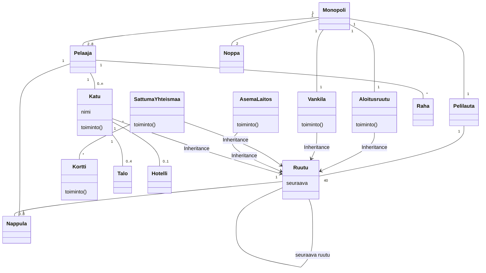

```mermaid
 classDiagram
      Monopoli "1" -- "1" Pelilauta
      Monopoli "1" -- "2..8" Pelaaja
      Pelilauta "1" -- "40" Ruutu
      Ruutu : seuraava
      Pelaaja "1" -- "1" Nappula
      Ruutu "1" -- "0..8" Nappula
      Monopoli "1" -- "2" Noppa
      Ruutu -- Ruutu : seuraava ruutu
      Aloitusruutu --> Ruutu : Inheritance
      Aloitusruutu : toiminto()
      Vankila --> Ruutu : Inheritance
      Vankila : toiminto()
      SattumaYhteismaa --> Ruutu : Inheritance
      SattumaYhteismaa : toiminto()
      SattumaYhteismaa "*" -- "*" Kortti
      class Kortti {
       toiminto()
       }
      AsemaLaitos --> Ruutu : Inheritance
      AsemaLaitos : toiminto()
      Katu --> Ruutu : Inheritance
      class Katu {
       nimi
       toiminto()
       }
      Katu "1" -- "0..4" Talo
      Katu "1" -- "0..1" Hotelli
      Pelaaja "1" -- "0..n" Katu
      Pelaaja "1" -- "*" Raha
      Monopoli "1" -- "1" Aloitusruutu
      Monopoli "1" -- "1" Vankila
```
