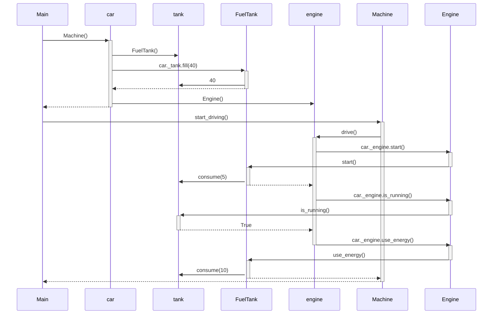

```mermaid
sequenceDiagram
Main ->>+ car: Machine()
car ->> tank: FuelTank()
car ->>+ FuelTank: car._tank.fill(40)
FuelTank ->> tank: 40
FuelTank -->>- car: 
car ->> engine: Engine()
car -->>- Main: 
Main ->>+ Machine: start_driving()
Machine ->>+ engine: drive()
engine ->> Engine: car._engine.start()
activate Engine
Engine ->>+ FuelTank: start()
deactivate Engine
activate FuelTank
FuelTank ->> tank: consume(5)
FuelTank -->> engine: 
deactivate FuelTank
engine ->> Engine: car._engine.is_running()
activate Engine
Engine ->>+ tank: is_running()
deactivate Engine
tank -->>- engine: True
engine ->>- Engine: car._engine.use_energy()
activate Engine
Engine ->>+ FuelTank: use_energy()
deactivate Engine
FuelTank ->> tank: consume(10)
FuelTank -->>- Machine: 
Machine -->>- Main: 
```
