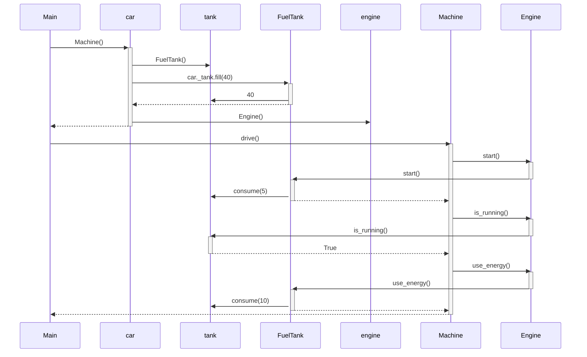

```mermaid
sequenceDiagram
Main ->>+ car: Machine()
car ->> tank: FuelTank()
car ->>+ FuelTank: car._tank.fill(40)
FuelTank ->> tank: 40
FuelTank -->>- car: 
car ->> engine: Engine()
car -->>- Main: 
Main ->> Machine: drive()
activate Machine
Machine ->> Engine: start()
activate Engine
Engine ->>+ FuelTank: start()
deactivate Engine
activate FuelTank
FuelTank ->> tank: consume(5)
FuelTank -->> Machine: 
deactivate FuelTank
Machine ->> Engine: is_running()
activate Engine
Engine ->> tank: is_running()
deactivate Engine
activate tank
tank -->> Machine: True
deactivate tank
Machine ->> Engine: use_energy()
activate Engine
Engine ->> FuelTank: use_energy()
deactivate Engine
activate FuelTank
FuelTank ->> tank: consume(10)
FuelTank -->> Machine: 
deactivate FuelTank
Machine -->> Main: 
deactivate Machine
```
