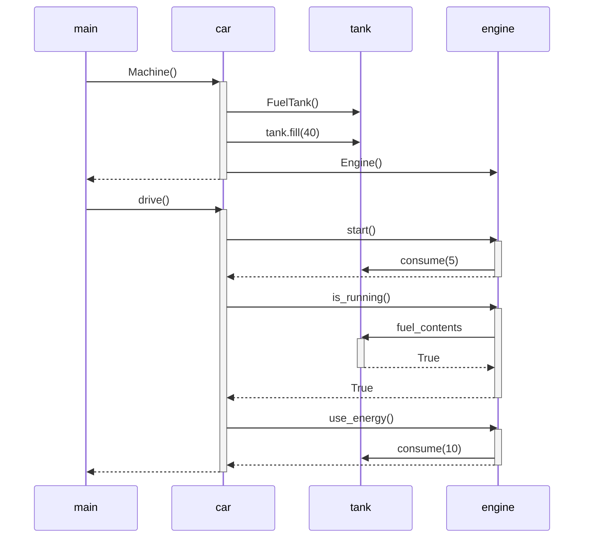

```mermaid
sequenceDiagram
main ->>+ car: Machine()
car ->> tank: FuelTank()
car ->> tank: tank.fill(40)
car ->> engine: Engine()
car -->>- main: 
main ->> car: drive()
activate car
car ->> engine: start()
activate engine
engine ->> tank: consume(5)
engine -->> car: 
deactivate engine
car ->> engine: is_running()
activate engine
engine ->> tank: fuel_contents
activate tank
tank -->> engine: True
deactivate tank
engine -->> car: True
deactivate engine
car ->> engine: use_energy()
activate engine
engine ->> tank: consume(10)
engine -->> car: 
deactivate engine
car -->> main: 
deactivate car
```
